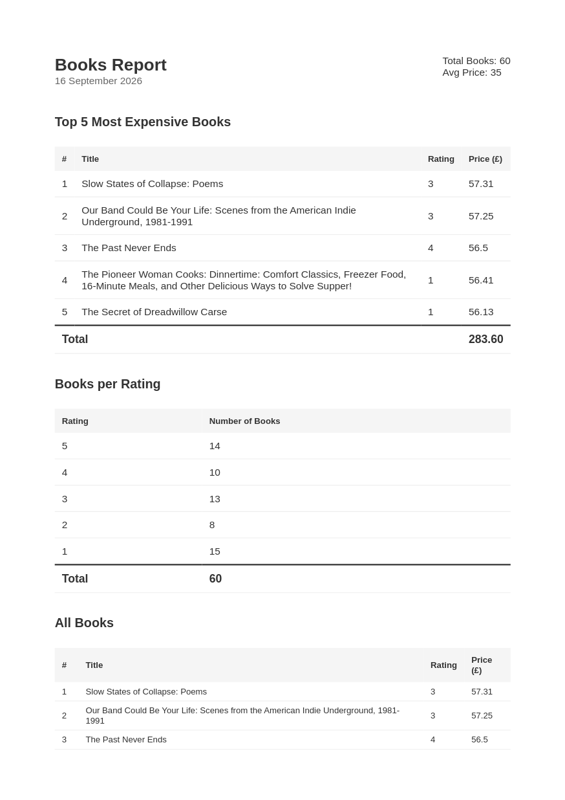

# PDF Report Generator

A NestJS service that generates a PDF report from a scraped dataset, stores reports in SQLite, and serves them over an HTTP API.

## What this is

- **NestJS + TypeORM (better-sqlite3)** backend with a `book` table and a `report` table in a local SQLite file (`report.db`).
- **Aggregation in the database**: the report is computed with SQL (top-5 most expensive books, average price, number of books per rating), so the service layer never computes aggregates in JS.
- **PDF rendering** via Handlebars HTML template + Playwright, written to disk by `ReportStorageService` and streamed back through the API.


## How to run it

```bash
pnpm install
pnpm seed       # clears the book table and inserts books.json
pnpm start:dev  # starts the API (default port 3000)
```

## Endpoints

| Endpoint | Description |
| --- | --- |
| `POST /reports` | Generates today's report; returns `201` with the report id (or `200` if today's report already exists). Pass `{ "force": true }` to regenerate anyway. |
| `GET /reports/:id` | Report metadata. |
| `GET /reports/:id/file` | The rendered PDF. |

## Dataset

`src/database/seeding/books.json`: books scraped from [https://books.toscrape.com/](https://books.toscrape.com/). Each row has a title, price, rating (1-5), and url. The seed script clears the `book` table and inserts this data.

## Aggregation SQL

Equivalent SQL behind the read model in `src/reports/report-data.service.ts`:

```sql
-- Top 5 most expensive books
SELECT title, price, rating, url
FROM book
ORDER BY price DESC
LIMIT 5;

-- Average price of all books
SELECT AVG(price) FROM book;

-- Number of books per rating
SELECT rating, COUNT(*) AS count
FROM book
GROUP BY rating
ORDER BY rating DESC;
```
<br/>

## Examples

### 1. First `POST /reports`: creates the report (`201`)

```bash
curl -i -X POST http://localhost:3000/reports
```

```
HTTP/1.1 201 Created
Content-Type: application/json; charset=utf-8
Date: Wed, 16 Sep 2026 13:31:11 GMT

{"id":"9176e12f-3e23-46b6-ac9b-52e25ad68aa7","file":"/reports/9176e12f-3e23-46b6-ac9b-52e25ad68aa7/file"}
```

### 2. Same request again: idempotent, same id, `200` instead of `201`

```bash
curl -i -X POST http://localhost:3000/reports
```

```
HTTP/1.1 200 OK
Content-Type: application/json; charset=utf-8
Date: Wed, 16 Sep 2026 13:31:15 GMT

{"id":"9176e12f-3e23-46b6-ac9b-52e25ad68aa7","file":"/reports/9176e12f-3e23-46b6-ac9b-52e25ad68aa7/file"}
```

### 3. `POST /reports` with `{"force": true}`: regenerates, new id (`201`)

```bash
curl -i -X POST http://localhost:3000/reports \
  -H "Content-Type: application/json" \
  -d '{"force": true}'
```

```
HTTP/1.1 201 Created
Content-Type: application/json; charset=utf-8
Date: Wed, 16 Sep 2026 13:31:21 GMT

{"id":"cd0c6a3f-f595-42e5-992a-12959fa12096","file":"/reports/cd0c6a3f-f595-42e5-992a-12959fa12096/file"}
```
## Generated PDF

<p align="center">
  
</p>

<br>

# Additional notes
## When the request becomes backgroun job
I would move PDF generation out of the request once rendering takes long enough (several seconds) or happens often enough, foe example, big reports or many concurrent users:  that holding the HTTP connection open makes requests fragile, times out, and blocks users, at which point the POST should enqueue a background job and return immediately with a status the client can poll.

## Idempotency
The project is designed so that a new report is generated only if there is no report for today yet, or if the request explicitly says to generate one anyway (even if today's report already exists). This protection saves resources by preventing unnecessary or accidental report generation, and it can be useful when sending emails, so they are not sent multiple times.